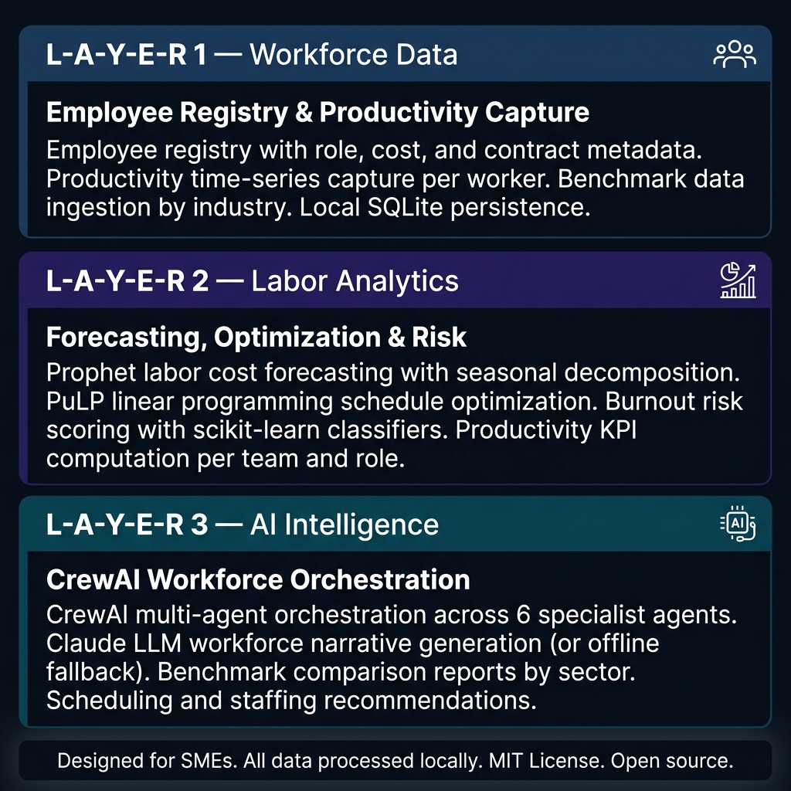
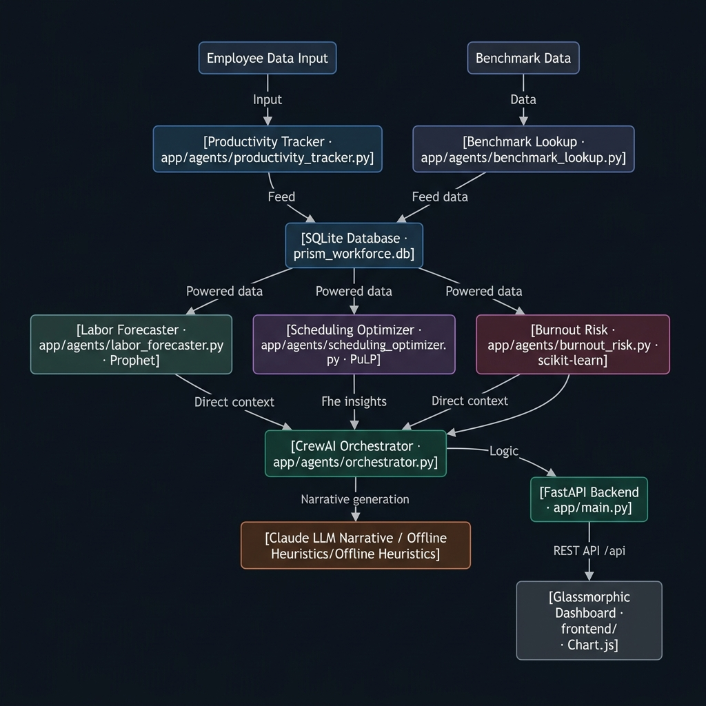
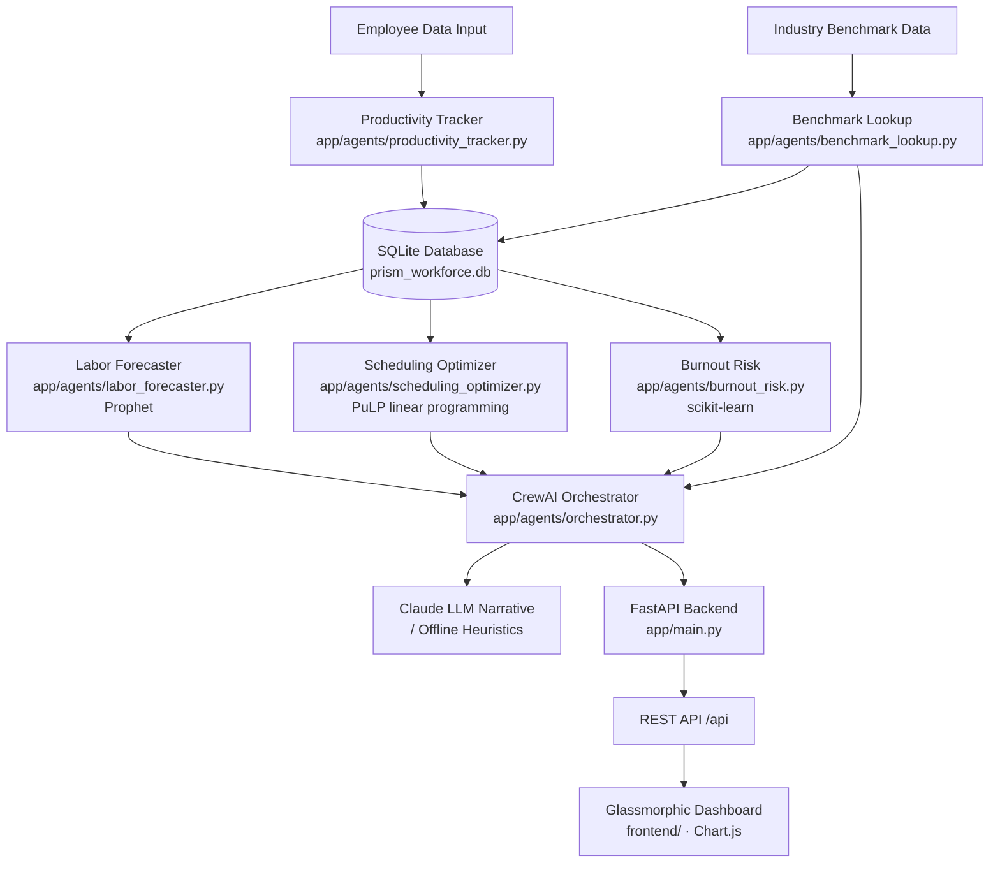

# PRISM — Productivity & Labor Cost Intelligence System

[](https://opensource.org/licenses/MIT)
[](https://www.python.org/)
[](https://fastapi.tiangolo.com/)
[](https://crewai.com/)
[](https://facebook.github.io/prophet/)
[](https://coin-or.github.io/pulp/)
[](https://airc.nist.gov/RMF)

> **An open-source workforce intelligence system for SMEs — Prophet labor cost forecasting, PuLP schedule optimization, burnout risk scoring, and CrewAI multi-agent orchestration for workforce analytics.**

PRISM is an open-source productivity and labor cost intelligence system. It tracks employee productivity metrics, forecasts labor costs with time-series modeling, optimizes workforce schedules using linear programming, scores burnout risk, and compares performance against industry benchmarks — all orchestrated through a CrewAI multi-agent layer running locally with no cloud dependency.

---

## How It Works — Three Integrated Layers



### Layer 1 — Workforce Data

Registers employees with role, cost center, contract type, and labor cost metadata. Captures productivity time-series per worker and team. Ingests industry benchmark data for comparative analysis. Persists all records to a local SQLite database.

```
Input:  Employee records · productivity logs · industry benchmark data
Output: Workforce database — registered, time-series structured, benchmark-enriched
```

### Layer 2 — Labor Analytics

Trains Facebook Prophet models on labor cost history to produce seasonal-aware forecasts. Runs PuLP linear programming optimization to minimize scheduling costs while satisfying coverage constraints. Scores burnout risk with scikit-learn classifiers trained on workload, tenure, and overtime patterns. Computes KPIs per employee, team, and cost center.

```
Input:  Workforce database + productivity time-series
Output: Labor cost forecast · optimized schedule · burnout risk scores · productivity KPIs
```

### Layer 3 — AI Intelligence

CrewAI orchestrates six specialist agents across workforce analytics tasks. Generates natural language workforce narratives using Anthropic Claude (or offline rule-based heuristics). Produces benchmark comparison reports by industry sector. Surfaces scheduling and staffing recommendations with explainable justifications.

```
Input:  Forecasts + optimization results + risk scores + benchmark data
Output: Workforce narrative · benchmark report · scheduling recommendations · staffing alerts
```

---

## Technical Architecture





### REST API Surface

| Endpoint | Method | Description |
|---|---|---|
| `/api/employees` | `GET / POST` | Employee registry — list or register |
| `/api/productivity` | `GET / POST` | Productivity metrics per employee and team |
| `/api/forecast` | `GET` | Labor cost projections with seasonal decomposition |
| `/api/schedules` | `GET / POST` | Optimized schedule — view or trigger optimization run |
| `/api/burnout` | `GET` | Burnout risk scores and alert flags |
| `/api/system` | `GET` | System status, AI mode (`llm` or `offline`), version |

### Stack

| Component | Technology |
|---|---|
| Backend | FastAPI 0.115 (Python 3.11+) |
| Agent Orchestration | CrewAI 0.80.0 · LangChain 0.3.7 |
| Labor Forecasting | Prophet 1.1.5 |
| Schedule Optimization | PuLP 2.9.0 (linear programming) |
| Burnout Scoring | scikit-learn 1.5.2 |
| Benchmark Embedding | sentence-transformers 3.2.1 |
| AI Narrative | Anthropic Claude (optional) · offline heuristics fallback |
| Database | SQLite (zero-server, local-first) · SQLAlchemy |
| Dashboard | HTML + CSS + JavaScript · Chart.js |
| Testing | pytest · pytest-asyncio · httpx |

---

## Key Design Decisions

**Scheduling as optimization, not heuristics.** PRISM uses PuLP integer linear programming to find schedules that minimize labor cost while satisfying coverage constraints — not greedy assignment or random search.

**Seasonal labor forecasting.** Prophet decomposes labor cost time-series into trend and seasonality components, producing forecast intervals that account for known business cycles (holidays, fiscal quarters, peak seasons).

**Burnout risk as a lagging-indicator model.** The scikit-learn classifier uses a combination of workload intensity, overtime frequency, tenure, and historical absenteeism to score burnout risk before it manifests — not after.

**Zero-server dependency.** SQLite requires no database server. The full workforce intelligence stack starts with `python run.py`.

**NIST AI RMF 1.0 alignment.** Every agent decision, forecast run, and AI-generated narrative is logged with structured metadata following NIST governance principles: validity, reliability, explainability, and human oversight.

---

## Who Is This For?

PRISM is built for SME operations managers, HR directors, and labor cost analysts who need workforce intelligence without enterprise HRMS costs.

**You do not need an operations research background.** Register your team, log productivity metrics, and run `python run.py`. PRISM handles forecasting, schedule optimization, and risk scoring automatically.

---

## Quickstart

```bash
git clone https://github.com/afild/PRISM.git PRISM
cd PRISM
pip install -r requirements.txt
python run.py
```

Open `http://localhost:8004` in your browser.

---

## AI Modes

**LLM Mode:**

```bash
export ANTHROPIC_API_KEY=your_key_here   # Linux/macOS
set ANTHROPIC_API_KEY=your_key_here      # Windows
python run.py
```

**Offline Mode** (default): All analytics — forecasting, schedule optimization, burnout scoring, and KPI computation — operate identically. The CrewAI workforce narrative agent uses structured rule-based report templates.

---

## Getting Started

### Prerequisites
- Python 3.11 or higher
- Git

### Installation

```bash
git clone https://github.com/afild/PRISM.git PRISM
cd PRISM
python -m venv venv
source venv/bin/activate   # Windows: venv\Scripts\activate
pip install -r requirements.txt
cp .env.example .env
python run.py
```

### Running Tests

```bash
pytest tests/ -v
```

---

## NIST AI RMF 1.0 Alignment

| NIST Function | PRISM Implementation |
|---|---|
| **GOVERN** | MIT License · open audit trail · traceable agent decisions |
| **MAP** | Workforce analytics domain scoped to SME labor management · documented model assumptions |
| **MEASURE** | pytest suite · Prophet forecast residuals per run · PuLP solver convergence validation |
| **MANAGE** | Offline fallback · optimization constraints enforced · burnout alerts require human review |

The AI narrative agent receives only computed aggregate metrics (KPIs, forecast values, optimization results) — never individual employee records or sensitive labor data.

---

## Repository Structure

```
PRISM/
├── app/
│   ├── main.py                          ← FastAPI app · router · static serving
│   ├── config.py                        ← Pydantic settings
│   ├── agents/
│   │   ├── orchestrator.py              ← CrewAI orchestration across 6 agents
│   │   ├── productivity_tracker.py      ← KPI computation per employee and team
│   │   ├── labor_forecaster.py          ← Prophet labor cost forecasting
│   │   ├── scheduling_optimizer.py      ← PuLP schedule optimization
│   │   ├── burnout_risk.py              ← scikit-learn burnout risk classifier
│   │   └── benchmark_lookup.py          ← Industry benchmark ingestion and lookup
│   ├── api/
│   │   ├── router.py
│   │   ├── employees.py
│   │   ├── productivity.py
│   │   ├── forecasts.py
│   │   ├── schedules.py
│   │   ├── alerts.py
│   │   └── system.py
│   ├── database/
│   │   ├── db_manager.py
│   │   └── schema.sql                   ← Tables: employees · productivity_logs · schedules · forecasts
│   └── plugins/
│       └── nova_reader.py               ← Read-only NOVA financial context connector
├── data/                                ← Benchmark datasets by industry
├── docs/
│   └── images/                          ← Architecture diagrams
├── frontend/
│   ├── index.html                       ← Glassmorphic dashboard
│   ├── styles.css
│   └── app.js                           ← Chart.js · schedule grid · KPI cards
├── tests/
├── .env.example
├── requirements.txt
└── run.py
```

---

## Contributing

Areas where contributions are most needed:
- ATS (Applicant Tracking System) integration for hiring cost modeling
- Multi-location workforce management across time zones
- Real-time productivity API connectors (time-tracking tools)
- Docker Compose setup for zero-dependency deployment

---

## Changelog

### Latest: v0.1.0
- Full workforce intelligence pipeline: productivity tracking, labor forecasting, schedule optimization, burnout risk, benchmark comparison

---

## License

MIT License — free to use, adapt, and redistribute.
